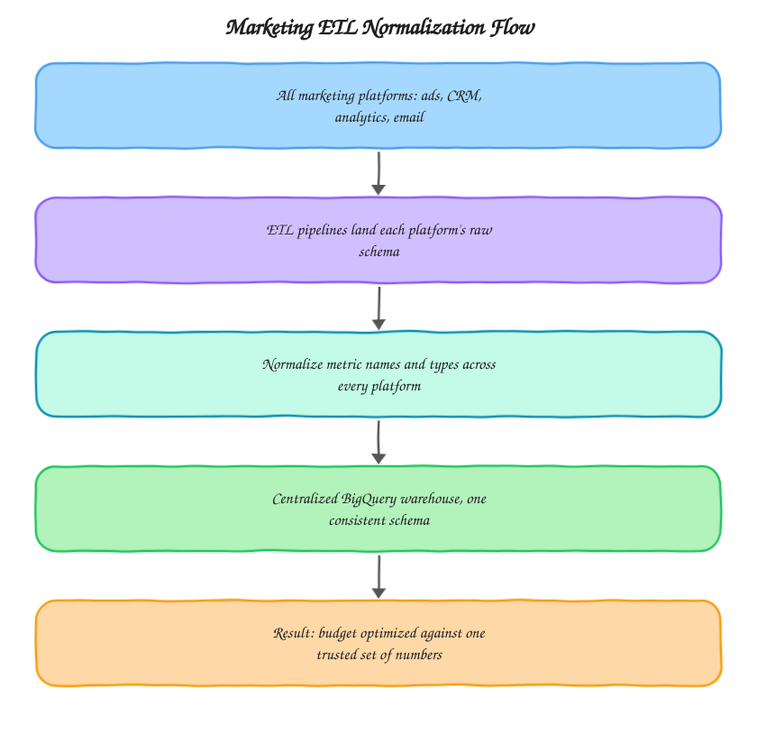

# Marketing ETL Normalization

End to end ETL pipelines that connect every marketing platform an enterprise team uses into one centralized BigQuery warehouse with genuinely normalized metrics, not just co-located raw tables. Built from the kind of large-scale ETL work I do at [motabar.builds.stuff](https://motabar.builds.stuff) for enterprise marketing teams running ten or more platforms at once.

## The problem this solves

At enterprise scale, "centralize the data" usually happens, every platform's raw export lands in the warehouse somewhere, but "normalize the data" usually doesn't. Each platform reports spend, impressions, and conversions with its own definitions, its own currency handling, and its own attribution window, so even after centralizing, budget decisions still require someone manually reconciling numbers that were never meant to be compared directly. This project is the normalization layer that makes the centralized data actually comparable across platforms, which is what makes cross-platform budget optimization possible at all.

## Architecture

Normalization happens once, centrally, rather than being re-derived inside every report that needs to compare platforms. That's the difference between this and simply landing everything in one warehouse, the schema normalization step is a deliberate, tested, version-controlled transformation, not an assumption baked into a dashboard query.

## What's in here

* `python/normalize_platform_schemas.py` defines the schema mapping for each platform (Google Ads, Meta, LinkedIn, TikTok, and others) onto one normalized metric schema, and applies it during load
* `dbt_models/fct_normalized_marketing_metrics.sql` the resulting warehouse table, one consistent schema across every platform, ready for direct cross-platform comparison

## How it's used in practice

Each platform's connector lands data in its own native shape first, since forcing normalization at extraction time makes debugging a broken extractor much harder. The normalization step runs as a distinct pass afterward, applying each platform's schema mapping (field names, currency conversion, metric definitions) to produce one consistent output schema. Currency conversion in particular has to happen against the exchange rate on the date the spend occurred, not the date the pipeline runs, otherwise historical comparisons drift as exchange rates move.

## What good output looks like

`fct_normalized_marketing_metrics` should be queryable with a single `group by platform` and produce genuinely comparable spend, impressions, and conversion numbers, no platform-specific caveats needed in the query itself. If a report still needs a comment explaining why one platform's numbers aren't quite comparable to another's, that's a sign the normalization layer is missing something.

## Setup

1. Document each platform's native field names, currency handling, and metric definitions before writing any mapping code, this audit step catches most normalization bugs before they happen
2. Configure the schema mapping for each platform in `normalize_platform_schemas.py`
3. Run the ETL to land normalized data into the raw layer
4. Build `fct_normalized_marketing_metrics.sql` on top for the final comparable warehouse table

## Stack

Python, BigQuery, dbt, multiple ad platform APIs
